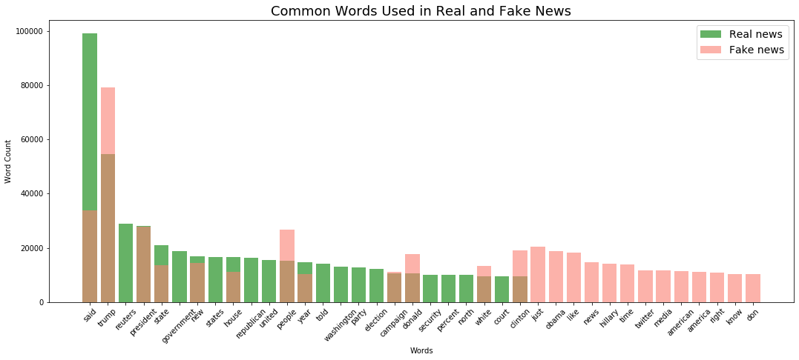
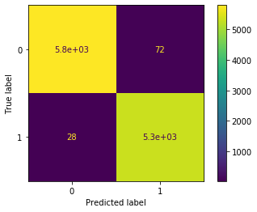

# Phony News Observations (PhoNOs)

## The Kaggle Competition

This project is the result of a [Kaggle](https://www.kaggle.com/clmentbisaillon/fake-and-real-news-dataset) dataset that was created by Clement Bisaillon. The point is to develop a model which can differentiate between real and fake news articles.

## What is in this repo?

| Files | Description |
|-|-|
| `true.csv` | dataset containing real news |
| `fake.csv` | dataset containing fake news |
| `real_or_fake.ipynb` | Jupyter notebook containing data cleaning steps and models |

## Data Dictionary

The data consisted of two data sets -- fake and real .csv files each with 23481 rows and 21417 rows of data respectively.  Each of these files contained news titles and body texts.

| Columns | Description |
|-|-|
| title | The title of the article in question |
| text | The body of the article |
| subject| Category of news |
| date| Date that the article was written |
| category | True = 1 ; Fake = 0 |
| weekday | The day of the week |

## Overall Thoughts

During our EDA this graph of the most common words for both fake an real news was generated.

A total of eight models were generated, five based on the title, and three based on the text. The three models types were Logistic Regression, Random Forest Classifier, and Extra Trees Classifier.

 

We immediately reached for logisitic regression, and it proved to be the right choice. Whether we used title or text as the modeling feature, logistic regression beat out the other models handily.

## Conclusions

| Methods | Model 1 | Model 2 | Model 3 | Model 4 | Model 5 | Model 6 | Model 7 | Model 8
|-|:-:|:-:|:-:|:-:|:-:|:-:|:-:|:-:|
| `PorterStemmer()` | X |  |  | X | X | | | |
| `CountVectorizer()` | X | X |  |  |  | | | |
| `TfidfVectorizer()` |  |  | X | X | X | X | X | X |
| `LogisticRegression()` | X | X | X | X |  | X | | |
| `RandomForestClassifier()` |  |  |  |  | X | | X | |
| `ExtraTreesClassifier()` | | | | | | | | X|
| `Title as Feature` | X | X | X | X | X | | | |
| `Text as Feature`| | | | | | X | X | X |
| Train Score: | 0.9849 | 0.9840 | 0.9505 | 0.9563 | 0.9504 | 0.9886 | 0.9895 | 0.9819|
| Test Score: | **0.9660** | 0.9529 | 0.9588 | 0.9643 | 0.9623 | 0.9910 | 0.9893 | 0.9824 |
**Hyperparameters used in best score:**
| Estimator/Transformer | Hyperparameter | Set to: |
|-|-|-|
| `TfidVectorizer()` | `stop_words` | `english` |
| `LogisticRegression()` | `max_iter` | 1000 |
| `LogisticRegression()` | `solver` | `liblinear` |
